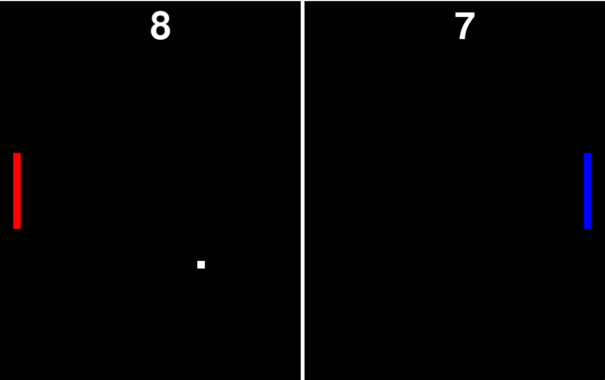

# PyPong

Welcome to the PyPong GitHub repository! PyPong is a simple implementation of the classic Pong game using Python and Pygame. Have fun playing and exploring the code!

## Download

You can download the latest release of PyPong from the [Releases](https://github.com/ShidWit/PyPong/releases) tab. Choose the appropriate release for your operating system and click on the download link to get the game.

## Features

- Classic Pong gameplay
- Player vs. AI mode
- Smooth ball movement and collision detection
- Score tracking for both players

## Getting Started

To run PyPong, follow these steps:

1. Download the latest release from the [Releases](https://github.com/ShidWit/PyPong/releases) tab.

2. Extract the downloaded archive to a location of your choice.

3. Open the extracted folder and run the `PyPong` executable.

4. Enjoy playing PyPong!

## How to Play

- Use the Up and Down arrow keys to control the paddle.
- Try to hit the ball with your paddle and prevent it from passing through.
- Score points by making the ball pass through the opponent's side.
- The first player to reach 10 points wins the game.

## Contributing

Contributions to PyPong are always welcome! If you have any ideas, bug reports, or feature requests, feel free to open an issue or submit a pull request.

## License

This project is licensed under the [MIT License](LICENSE).

## Connect

Stay connected and follow my latest updates:

- GitHub: [ShidWit](https://github.com/ShidWit)

Thank you for visiting the PyPong GitHub repository! Enjoy the game and have fun coding!
